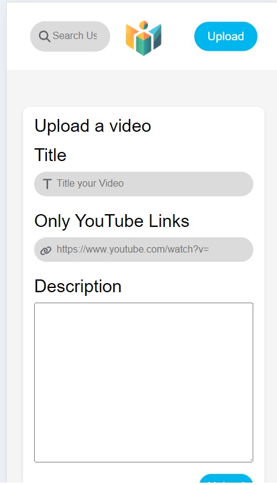
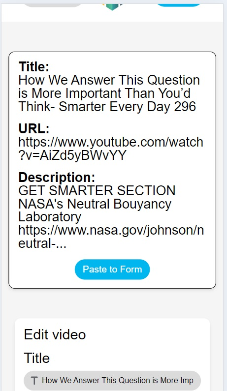

# Educational Video Player

A website where users can watch YouTube videos, upload YouTube video links, comment on videos, and search for videos from other users.

## Table of Contents

- [Description](#description)
- [Getting Started](#getting-started)

  - [Important Information](#important-information)
  - [Website Design](#website-design)

- [List of all Website features](#list-of-all-website-features)
- [Screenshots](#screenshots)

## Description

This is a frontend application which communicates with an API. With the frontend, the user can...

- View a list of videos.
- Upload YouTube links to new videos, including their title and description.
- Watch videos with full video controls.
- Comment on videos.

This project also includes additional features to better the user experience such as...

- Responsive web design for desktop and mobile.
- A splash page on the home screen for first time users.
- Animations to help the website feel more dynamic.
- Allows for searching of videos from other users.
- Pagination on comments to display them in increments.

A full list of features can be found at the bottom of this README.

## Getting Started

1. Clone or download this GitHub repo.

2. Install the libraries from the package.json file with your package manager.

```
npm install
```

3. Create a .env file in the **root** of the project directory containing the following 3 variables. The VITE_USER variable can be set to your name, or any user who you wished to be currently "signed in".

```
VITE_PROD_URL="https://take-home-assessment-423502.uc.r.appspot.com/api"
VITE_USER=""
VITE_DEV="true"
```

4. Start the dev server with...

```
npm run dev in your localhost.
```

5. Visit the site on your localhost with the port number shown in your terminal.

### Important Information

In order to make calls to the API while in development and avoid issures with CORS, a proxy was configured in the vite.config.js file.
In this file, you can see the target is set to the VITE_PROD_URL variable that should be set in the .env file.

```
server: {
    proxy: {
      "/api": {
        target: "https://take-home-assessment-423502.uc.r.appspot.com/api",
      },
    },
  },

```

This target is assigned the proxy of "/api". This means that when we fetch the URL, "/api", we will fetch the target URL. We can also append other parameters to "/api" to reach other API endpoints.

In other words, this...

```
fetch("/api/videos/12345")
```

is equivalent to...

```
fetch("https://take-home-assessment-423502.uc.r.appspot.com/api/videos/12345")
```

### Website Design

- Used React Router to separate pages.
- Practiced componentization by splitting pages into components.
- Created reusable components that are used on multiple pages such as the VideoFrame component.
- Use of React hooks such as useState, useEffect, useRef.
- React state variables are used in multiple scenarios, such as managing styles, used for conditional rendering of elements, and storing data recieved from the API.

## List of all Website features

#### Main features

- Users can view a list of their videos on the home page.
- Users can upload new videos by providing a title, description, and URL.
- Users can comment on videos.
- Users have full video control including, fullscreen, volume control, and playback speed.

#### Extra features

- Responsive web design on desktop and mobile.
- A splash screen is displayed on the Home page when the user first visits the website. A custom LocalStorage hook is used to determine whether the user has visited previously.
- On the Edit Video Page, the original video data is displayed as well as an option to paste it into the form.
- Animations to enlarge textboxes on focus.
- Empty videos contain error message.
- On video load, a random loading animation in a random color is played with an artificial load time before the video loads in.
- Submitting a comment disables the submit button and has a slight delay before being enabled again for a better user experience.
- Newly submitted comments are rendered on the video page without needing to refresh.
- Comments are loaded by 10. Users can click on the "Load More Comments" button to load the next 10 comments.
- Loading More Comments button triggers a loading animation.
- Error page for invalid urls.
- The Navbar Search box can search for videos by user (case sensitive).

## Screenshots

### Desktop


### Mobile

[](/src/assets/screenshots/mobile_1.jpg)

[](/src/assets/screenshots/mobile_2.jpg)

[](/src/assets/screenshots/mobile_3.jpg)
